# Projet DevOps · velos-api

**Nom et prénom :** KOFFI Andrea Wendy
**Groupe :** M2DAN26.1
**Dépôt :** https://github.com/andreawendys/velos-api
**Image publiée :** docker.io/andreawendys/velos-api:1.0 (https://hub.docker.com/r/andreawendys/velos-api)
**Date de rendu :** 28/08/2026

---

## 1. Ce que j'ai construit, en cinq lignes

Pour ce projet, j'ai repris une application Flask fournie (`velos-api`), qui expose l'état de stations de vélos en libre-service. Je l'ai versionnée avec Git/GitHub (branches, conflit résolu, pull request, tag, branche protégée), puis conteneurisée avec Docker (image multi-étages sans privilèges, pile compose avec PostgreSQL persistant). Je l'ai ensuite déployée dans un cluster Kubernetes local (kind), avec une base de données, un secret pour le mot de passe, et j'ai démontré la mise à l'échelle, la résistance aux pannes et une mise à jour sans coupure vers une version 2 (ajout de la route `/alertes`). Enfin, j'ai automatisé toute la chaîne avec Jenkins : un pipeline versionné qui teste, construit, publie et déploie automatiquement à chaque `git push`, avec une démonstration du "rouge utile".

## 2. Le trajet d'une requête

Quand l'application tourne dans le cluster Kubernetes, une requête suit ce trajet :

1. Le navigateur envoie une requête vers `http://localhost:8081/...`
2. Le port 8081 de ma machine est relié, via `extraPortMappings` du fichier `kind-cluster.yaml`, au port 30081 du nœud control-plane du cluster
3. Ce port 30081 est le `nodePort` déclaré dans le Service `velos-api` (type `NodePort`)
4. Le Service sélectionne, grâce à son `selector` (`app: velos-api`), l'un des pods portant cette étiquette
5. Le pod choisi exécute le conteneur Flask, qui reçoit la requête sur son port 8000
6. Si la route nécessite les données, l'application lit `DATABASE_URL` (injectée depuis le Secret `velos-secret`) et se connecte à PostgreSQL via le nom du Service `velos-db`, résolu par le DNS interne du cluster
7. PostgreSQL répond, Flask construit la réponse JSON et la renvoie jusqu'au navigateur

---

## 3. Jalon 1 · Git

**Ce que j'ai fait :** J'ai initialisé un dépôt local `velos-api` avec le code fourni, créé un `.gitignore` adapté dès le départ, puis travaillé sur plusieurs branches que j'ai nommées. J'ai créé un dépôt GitHub public, relié en SSH. J'ai ouvert une pull request avec un commentaire de revue, que j'ai fusionnée. J'ai posé le tag `v1.0.0` et activé une protection sur la branche `main` (pull request obligatoire + approbation requise + interdiction de contournement).

**Le conflit :** Sur la route `/sante` de `app.py`. Deux branches modifiaient la même ligne différemment : l'une ajoutait `"service": "velos-api"`, l'autre ajoutait `"environnement": "production"`. J'ai résolu le conflit en combinant les deux propositions, puis, dans un commit séparé et traçable, j'ai simplifié la réponse pour ne garder que `"statut"` et `"version"`.

**Ce que je retiens :** Un conflit n'est pas une erreur mais une situation normale en collaboration. Sur la protection de branche, j'ai découvert que par défaut, GitHub laisse le propriétaire d'un dépôt contourner ses propres règles de protection — j'ai dû cocher explicitement l'option « interdire le contournement » pour que la protection s'applique aussi à moi-même, et j'ai vérifié ce comportement en tentant un envoi direct qui a bien été refusé

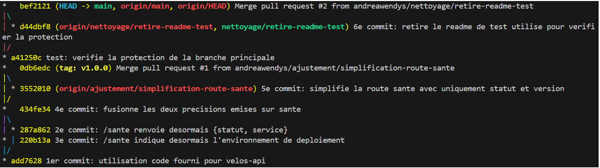
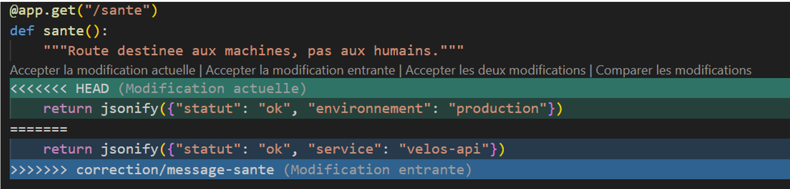
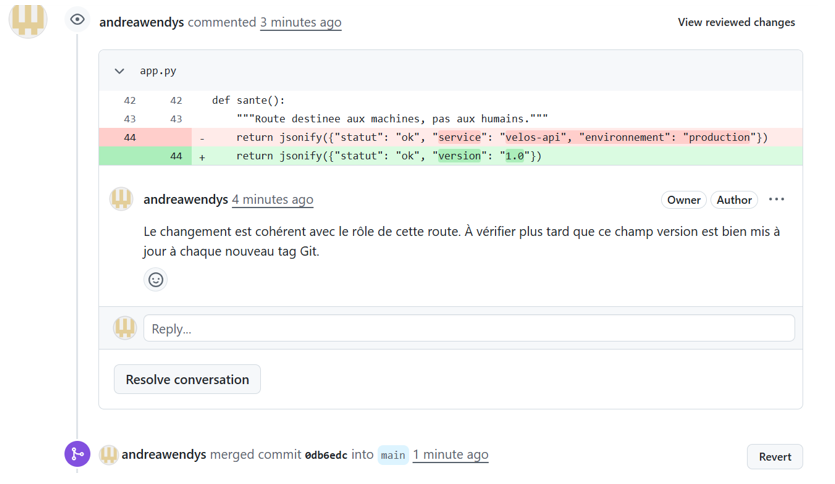
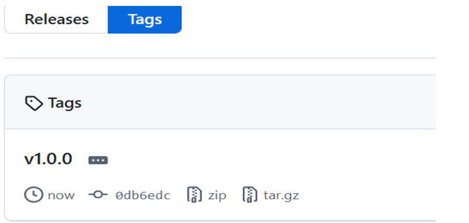
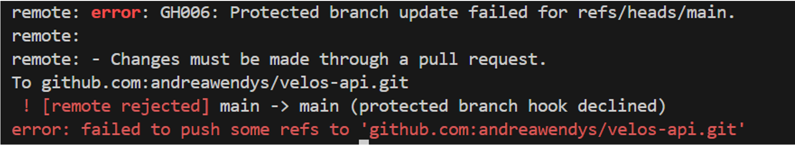

---

## 4. Jalon 2 · Docker

**Mesure du cache de construction**

| Situation | Durée mesurée |
| --- | --- |
| Dépendances copiées après le code | ~12.7s |
| Dépendances installées avant le code | ~1.9s |

**Taille de l'image**

| Version | Taille |
| --- | --- |
| Naïve, un seul étage | 1.63 GB |
| Finale, plusieurs étages | 195 MB |

**Ce que le fichier d'exclusion de construction évite d'envoyer :** Il evite l'envoi du dossier `.git`, l'environnement virtuel `venv/`, les fichiers compilés Python, un éventuel `.env`, ainsi que le Dockerfile, le compose.yaml et les fichiers Markdown eux-mêmes.

**Comment j'ai prouvé la persistance :** J'ai ajouté une station de test dans la base, détruit complètement les conteneurs (`docker compose down`), puis remonté la pile. La station était toujours présente, preuve que la donnée vit dans le volume nommé.

**Ce que je retiens :** L'ordre des instructions dans un Dockerfile a un impact direct et mesurable sur la vitesse de construction : placer les dépendances avant le code permet de tirer pleinement parti du cache. La construction multi-étages, elle, est le geste le plus rentable pour réduire la taille de l'image et sa surface d'attaque. Enfin, un conteneur n'est jamais un endroit fiable pour stocker une donnée durable : seul un volume l'est vraiment, puisqu'il survit à la destruction complète du conteneur. 

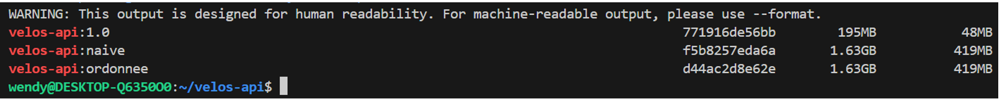
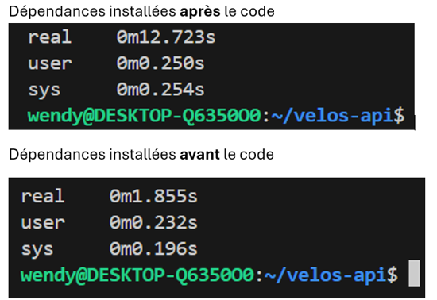
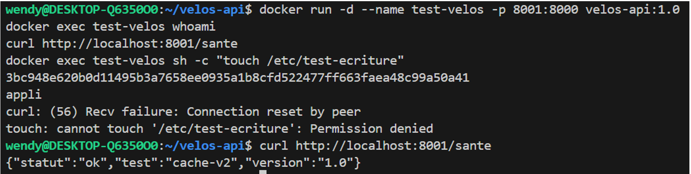
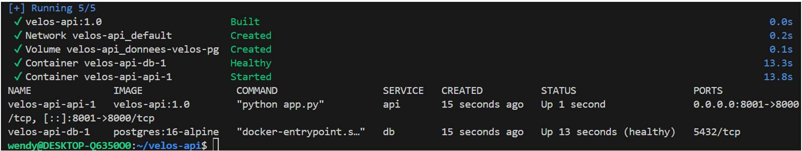
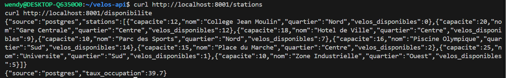
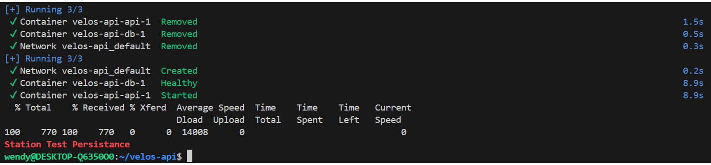

---

## 5. Jalon 3 · Kubernetes

**Comment j'ai obtenu le port 8081 vers le cluster :** J'ai déclaré `extraPortMappings` (containerPort 30081 → hostPort 8081) directement dans `kind-cluster.yaml`, avant de créer le cluster. 

**Où vit le mot de passe, et pourquoi ce n'est pas un coffre-fort :** Dans un Secret Kubernetes (velos-secret), créé en ligne de commande, jamais dans un fichier versionné. Ce n'est pas un vrai coffre-fort car la valeur est seulement encodée en base64, pas chiffrée. Je l'ai vérifié avec kubectl get secret ... | base64 -d, qui a immédiatement révélé le mot de passe en clair.

**Ce que j'ai observé en supprimant un exemplaire sous trafic :** La boucle `curl` en continu a affiché des réponses `200` sans interruption, malgré la destruction et recréation de tous les pods. Le déploiement les a recréés immédiatement, et le Service n'a jamais envoyé de trafic vers un pod non prêt.

**La mise à jour vers la version 2 :** J'ai ajouté `/alertes`, reconstruit l'image, chargée dans le cluster, puis appliqué le nouveau manifeste. Ma boucle de trafic a continué sans erreur, passant progressivement à la nouvelle version.

**Le retour arrière :** `kubectl rollout undo` a ramené la version précédente en quelques secondes, sans coupure, confirmé par `kubectl rollout history`.

**Ce que je retiens :** Kubernetes maintient l'application en état en continu : passage à l'échelle, tolérance aux pannes et mises à jour progressives sont natifs, à condition d'avoir déclaré correctement toutes les sondes.

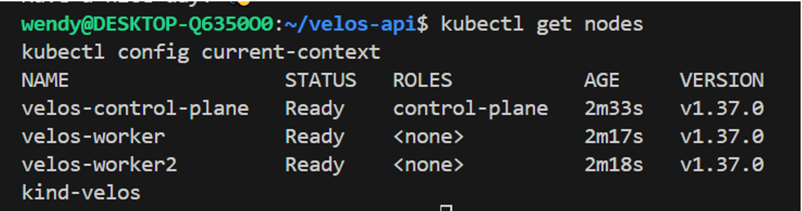
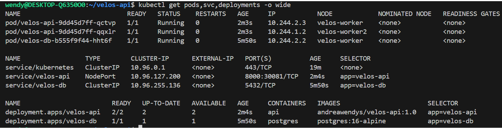
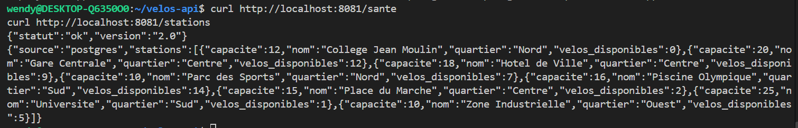
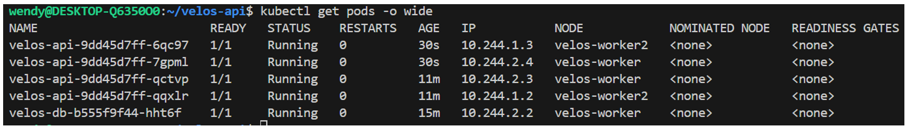
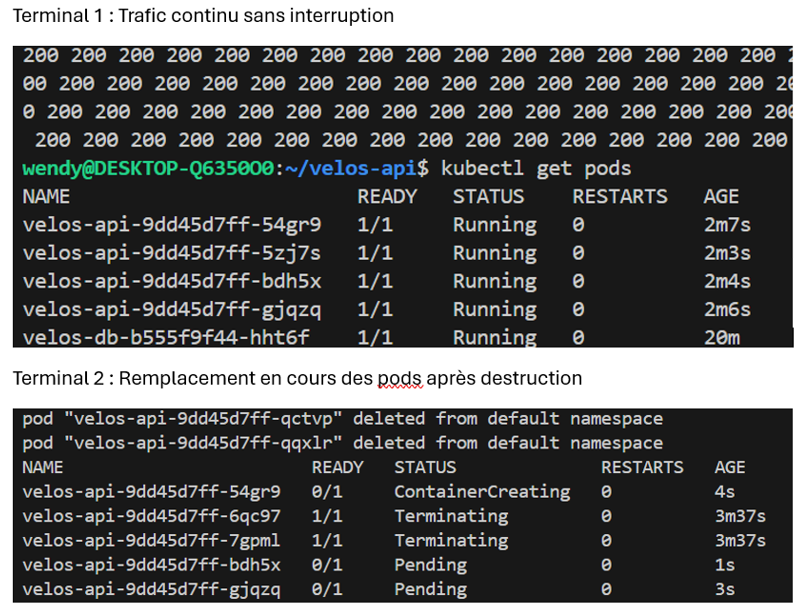
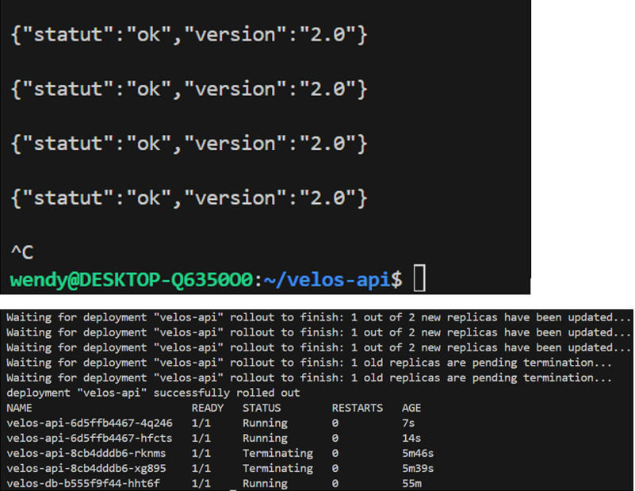
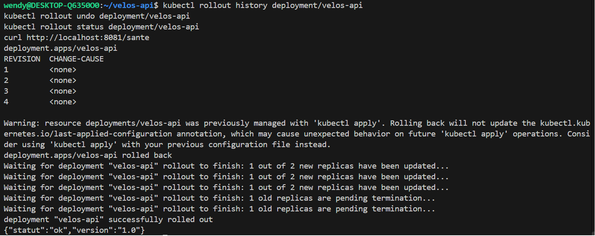

---

## 6. Jalon 4 · Jenkins

**Mes tests :** J'ai realisée trois tests avec `pytest` : `/sante` répond "ok", `/stations` renvoie les 4 stations du jeu de secours avec `"source":"memoire"`, et `/alertes` renvoie bien les stations à 2 vélos ou moins. Aucun n'a besoin de base de données, l'application se rabattant sur son jeu en mémoire.

**Les quatre étapes de mon pipeline :** Tester (image jusqu'à l'étage de test, pytest s'exécute), Construire (image finale taguée avec le numéro de build), Publier (push sur Docker Hub via identifiants Jenkins), Deployer (`kind load docker-image` puis mise à jour du déploiement et attente réelle).

**Comment mes images sont étiquetées, et pourquoi :** Avec `${env.BUILD_NUMBER}`, pour relier immédiatement une image en service à l'exécution qui l'a produite, contrairement à `latest`.

**La ligne qui rend mon pipeline honnête :** `kubectl rollout status deployment/velos-api --timeout=180s`. Sans elle, le pipeline se déclarerait vert même si les nouveaux pods restaient bloqués indéfiniment.

**Le rouge utile :** J'ai modifié `/sante` pour renvoyer `"degrade"` au lieu de `"ok"`, poussé le changement. Le pipeline s'est déclenché automatiquement, l'étape "Tester" a échoué, et Construire/Publier/Deployer ne se sont jamais exécutées. L'image en service est restée celle d'avant l'incident. J'ai ensuite corrigé et poussé, un nouveau build s'est déclenché automatiquement et a réussi.

**L'extrait de journal qui donne la cause :**

```
AssertionError: assert 'degrade' == 'ok'
- ok
+ degrade
tests/test_app.py:8: AssertionError
FAILED tests/test_app.py::test_sante_repond_ok
1 failed, 2 passed in 0.56s
```

**Ce que je retiens :** Un pipeline n'a de valeur que s'il peut réellement bloquer une mauvaise version. La preuve la plus importante est que la version en service reste inchangée pendant l'incident.

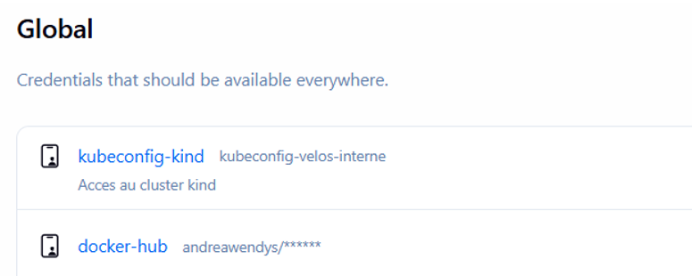
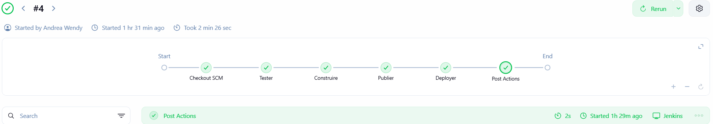
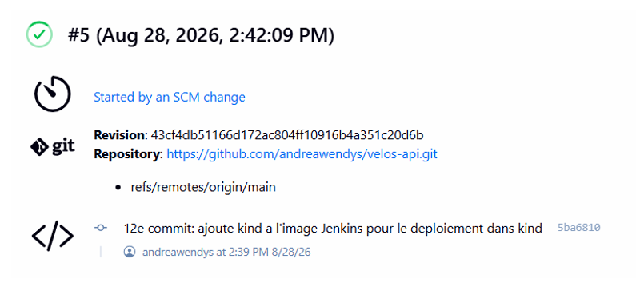
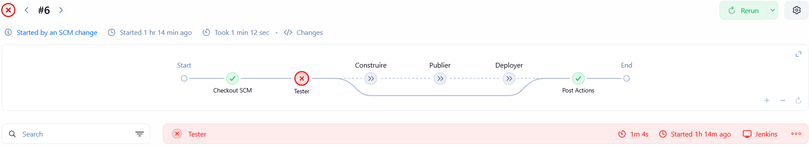
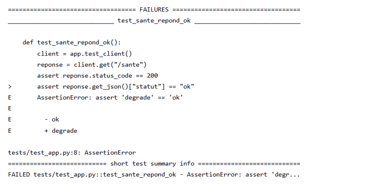
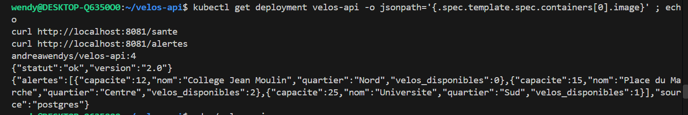

---

## 7. Mes trois difficultés

| # | Symptôme observé | Cause réelle | Correction apportée |
| --- | --- | --- | --- |
| 1 | Le pipeline échouait à l'étape Deployer avec `kind: not found` | L'image Jenkins ne contenait que `docker` et `kubectl`, pas `kind` | Ajout de l'installation de `kind` dans le Dockerfile Jenkins, reconstruction et redémarrage |
| 2 | Après recréation du conteneur Jenkins, erreur `dial tcp: lookup velos-control-plane ... no such host` | Jenkins recréé avait perdu son rattachement au réseau Docker du cluster kind | Reconnexion avec `docker network connect kind jenkins` |
| 3 | `/sante` affichait toujours `"version":"1.0"` même après déploiement de la v2.0 | Version écrite en dur dans le code, et `kubectl set image` ne relit pas les changements du manifeste | Version rendue dynamique via variable d'environnement, utilisation de `kubectl apply -f` pour ce changement |

---

## 8. Ce qui n'est pas fait

J'ai realisé l'ensemble des exigences obligatoires des quatre jalons techniques que j'ai eu a verifié et testé en conditions réelles. Cependant , je n'ai pas pu realisé les point bonus supplémentaires, faute de temps.

---

## 9. Assistance utilisée

J'ai utilisé Claude comme assistant pour déboguer des erreurs longues et persistantes rencontrées (réseau Jenkins-Kubernetes notamment), et pour l'amélioration de mes phrases dans ce rapport . Toutes les commandes ont été exécutées et vérifiées par moi-même .

---

## 10. Si j'avais deux jours de plus
Si j'avais 2jours de plus , 
D'abord, je prendrais et sauvegarderais les captures d'écran une par une, directement au bon endroit, au fur et à mesure du travail. Je les avais rassemblées dans un document Word par facilité, mais ce format n'était pas exploitable et j'ai dû reprendre cette étape en urgence, ce qui m'a fait perdre un temps précieux .
 Ensuite, j'aurais essayer de faire les étapes pour les points bonus , c'est a dire le HorizontalPodAutoscaler et un vrai `Ingress` plutôt qu'un simple `NodePort`.
